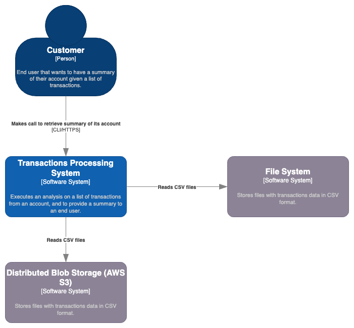
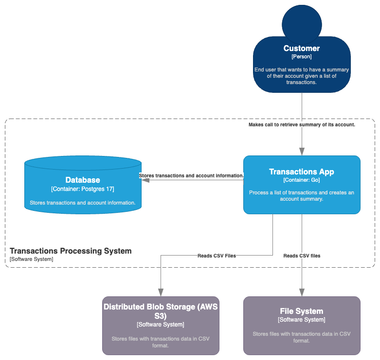
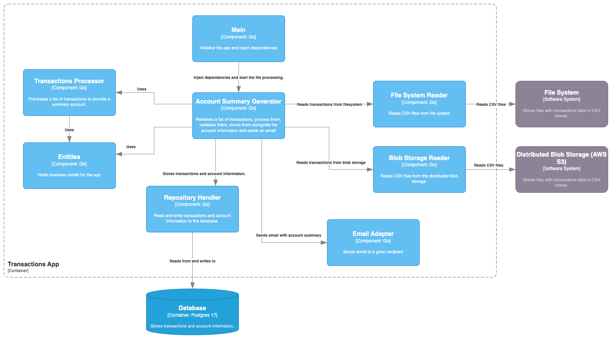

# Architecture

## Architecture Decision Records

I will record design decisions for the architecture to preserve the context of main choices.
These will be written in the format proposed in a
[blog post by Michael Nygard](http://thinkrelevance.com/blog/2011/11/15/documenting-architecture-decisions)

Please see the [decisions directory](decisions/) for a list of all ADRs.

### Tooling

I will use [adr-tools](https://github.com/npryce/adr-tools) to help manage the decisions.

`brew install adr-tools`

`make new-adr adr='Decision to record'`

Please ensure that this tool is used at the **root** of the project only.

### Rationale

#### Context

The challenge prompts us to build an account summary processor that can read either from
the file system or from a distributed blob storage. It sends notifications through email and
persists executions.

#### Runnable units

There is no expectation to have more than two runnable units, i.e. the application itself that will
perform the processing and the database. The email notification system will be run as part of the application
and I don't foresee any need to run it separately.

#### Transaction application

Inside the Transaction App, all adapters are thought as separate components.
A hexagonal architecture is a good fit for this application and hence all dependencies point
directly to the entities. More about it [here](/docs/architecture/decisions/0006-adapters-and-business-logic-borderline.md).

The Account Summary Generator act as an orchestrator, and it will be responsible for coordinating the read
of the input file, processing the account summary, and persisting and notifying the user about the results.

The Transactions Processor is responsible for the actual computations regarding the provided list of transactions.

### Code organization

- accountsummary: Package with the orchestrator logic. 
- adapters/emailsender: Package with the email notification logic.
- adapters/filereader: Package with the file reader logic. It can read both from the file system as from AWS S3.
- adapters/repository: Package with the repository logic. As requirements were small around persistence, it is solely storing the transactions results.
- build: Folder with the logic to run the app through Docker.
- data: Folder with sample data.
- docs: Documentation and architecture decisions.
- migrations: Folder with the database migrations to run at startup.
- mocks: Folder with the mocks for the tests.
- model: The package with the domain model.
- test: Package with utility functions to run the tests.
- transactions: Package with the logic to process the transactions.
